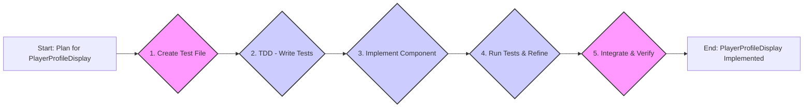

# Plan: Implement Simple Player Profile Display Component

**Objective:** Create a React component called `PlayerProfileDisplay` to display basic player profile information (AN, AW, GL) in the Isotope game UI.

**Confidence Level:** 9/10

**Rationale:** This plan prioritizes simplicity, elegance, and robustness by adhering to the KISS and DRY principles. It utilizes Test-Driven Development (TDD) to ensure component reliability and focuses on a minimal, functional design using Tailwind CSS for styling.

**Implementation Steps:**

1.  **Test File Creation:**

    - Create `src/ui/components/__tests__/PlayerProfileDisplay.test.tsx`

2.  **Test-Driven Development (TDD):**

    - Define tests in `PlayerProfileDisplay.test.tsx` covering:
      - Rendering with `an`, `aw`, and `gl` props and correct labels.
      - Clear and readable data display format.
      - Graceful default rendering for missing props (e.g., "N/A" or "0").

3.  **Component Implementation:**

    - Create `src/ui/components/PlayerProfileDisplay.tsx`
    - Implement as a functional React component.
    - Accept `an`, `aw`, and `gl` as props.
    - Use JSX for component structure.
    - Apply minimal Tailwind CSS styling for readability.

4.  **Run Tests and Refine:**

    - Run tests and iteratively develop the component until all tests pass.
    - Refine styling and structure based on test feedback and visual clarity.

5.  **Integration and Verification:**
    - Integrate `PlayerProfileDisplay` into the application UI (e.g., `src/App.tsx`).
    - Visually verify correct rendering and data display in the game UI.

**Mermaid Diagram - Plan Overview:**

**Next Steps:**

Once you switch to `code` mode, you can begin implementing the `PlayerProfileDisplay` component following the steps outlined in this plan.
